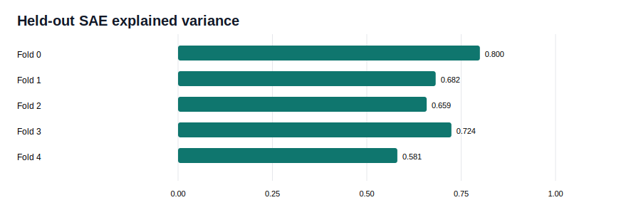
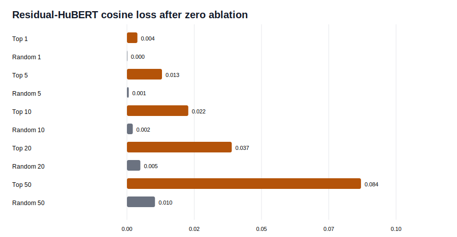

# Bottleneck Sparse Features And Causal Ablation

Fold-specific Top-K sparse autoencoders were trained on the 64-dimensional HuBERT
student bottleneck using training speakers only. Each SAE has 512 features and exactly
32 active features per sample.

## SAE Quality

| Fold | Test Explained Variance | Test MSE | Active Features | Dead Features |
|---:|---:|---:|---:|---:|
| 0 | 80.0% | 0.167 | 32.0 | 2.5% |
| 1 | 68.2% | 0.244 | 32.0 | 6.6% |
| 2 | 65.9% | 0.266 | 32.0 | 4.9% |
| 3 | 72.4% | 0.223 | 32.0 | 4.7% |
| 4 | 58.1% | 0.309 | 32.0 | 5.9% |

Mean held-out explained variance is **68.9%**.
Reconstruction changes student class accuracy from **64.0%**
to **63.3%**, so causal effects are measured relative
to reconstructed bottlenecks.

## Highest-Ranked Fold-Local Features

| Fold | Feature | Best Class | Best Type | Class Selectivity | Type Selectivity | Speaker Selectivity | Frequency | Stability |
|---:|---:|---:|---:|---:|---:|---:|---:|---:|
| 0 | 434 | 6 | 2 | 0.992 | 0.260 | 0.004 | 20.2% | 0.355 |
| 0 | 237 | 8 | 2 | 0.990 | 0.236 | 0.008 | 20.7% | 0.382 |
| 0 | 285 | 24 | 2 | 0.963 | 0.044 | 0.007 | 28.3% | 0.373 |
| 1 | 165 | 10 | 0 | 0.967 | 0.217 | 0.013 | 25.1% | 0.377 |
| 1 | 73 | 28 | 1 | 0.919 | 0.072 | 0.015 | 33.8% | 0.358 |
| 1 | 311 | 2 | 2 | 0.980 | 0.286 | 0.005 | 19.4% | 0.339 |
| 2 | 502 | 0 | 2 | 0.916 | 0.210 | 0.020 | 26.6% | 0.379 |
| 2 | 106 | 26 | 1 | 0.967 | 0.075 | 0.005 | 25.9% | 0.436 |
| 2 | 299 | 6 | 2 | 0.947 | 0.133 | 0.009 | 25.1% | 0.373 |
| 3 | 175 | 12 | 0 | 0.977 | 0.392 | 0.008 | 23.2% | 0.352 |
| 3 | 236 | 28 | 2 | 0.982 | 0.208 | 0.002 | 26.2% | 0.411 |
| 3 | 507 | 10 | 0 | 0.984 | 0.359 | 0.005 | 16.9% | 0.343 |
| 4 | 90 | 13 | 0 | 0.982 | 0.188 | 0.005 | 20.5% | 0.343 |
| 4 | 471 | 14 | 0 | 0.976 | 0.145 | 0.009 | 20.8% | 0.379 |
| 4 | 336 | 12 | 0 | 0.938 | 0.373 | 0.010 | 16.9% | 0.353 |

The top-20 features have mean cross-fold decoder stability **0.369**.
Feature IDs are therefore treated as fold-local rather than as globally identical concepts.

## Causal Result

Zeroing the top 50 content-ranked features, relative to SAE reconstruction:

- changes residual-HuBERT cosine by **-0.084**, versus
  **-0.010** for random features;
- changes utterance-type accuracy by **-5.8 points**,
  versus **-0.3 points** for random features;
- changes 30-class accuracy by **-2.4 points**,
  versus **-0.3 points** for random features.

The ranked features have a specific causal effect on HuBERT alignment and coarse
utterance type beyond random ablations. A larger 30-class effect also appears when 50
features are removed, but it is not monotonic at smaller intervention sizes, suggesting
that fine-grained class decisions remain more distributed or redundant.

## Boundary

This is evidence for causal contribution under feature ablation, not proof that a sparse
feature corresponds to a human-named phoneme or articulator. Temporal teachers and
sample-level feature inspection are required before assigning linguistic labels.
