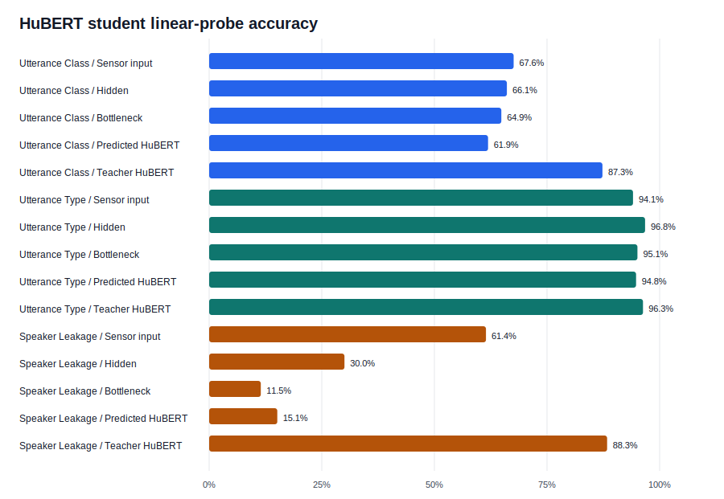
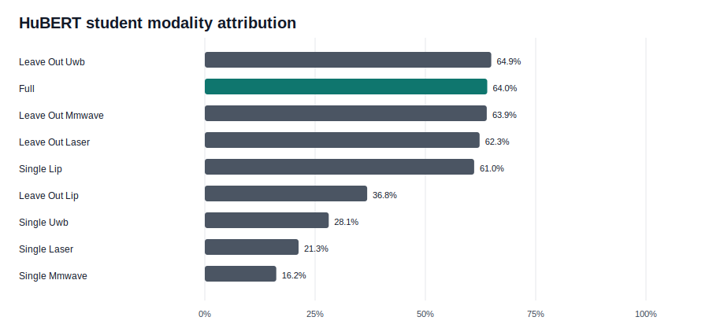

# HuBERT Student Interpretability Summary

This report consolidates the first real audio-teacher interpretability batch for the
contactless / microphone-free student.

## Core Results

- Five-fold student accuracy: **64.0%**, compared
  with **63.9%** for strict validation-weighted fusion.
- Residual-HuBERT cosine: **0.430**, versus
  **-0.001** for the train-mean residual direction.
- Bottleneck class probe: **64.9%**.
- Bottleneck utterance-type probe: **95.1%**.
- Speaker leakage falls from **61.4%**
  at sensor input to **11.5%**
  at the bottleneck.
- Lip alone reaches **61.0%**; removing lip drops
  accuracy by **27.2 points**.

## Interpretation

The 64-dimensional bottleneck preserves utterance class and coarse speech-type
information while removing most linearly decodable speaker identity. Lip is largely
sufficient for class decoding, while laser provides the largest auxiliary leave-one-out
gain. UWB and mmWave have measurable standalone information but little conditional
accuracy contribution once lip and the other sensors are present.

Centering HuBERT targets with training-fold statistics was essential. Without centering,
a trivial shared mean direction achieved very high cosine similarity and obscured
utterance-varying alignment. All final results use centered targets without test-speaker
statistics.

## Sparse Feature Causality

Fold-specific Top-K sparse autoencoders explain **68.9%**
of held-out bottleneck variance. Ablating the top 50 content-ranked features changes
residual-HuBERT cosine by **-0.084** and
utterance-type accuracy by **-5.8 points**,
compared with **-0.010** and
**-0.3 points** for random features.
See `reports/hubert_bottleneck_feature_causality.md` for all controls.

## Subsequent Interpretability Work

Sparse feature causality, held-out activation exemplars, and a four-segment temporal
HuBERT comparison are now complete; see `reports/temporal_interpretability_batch.md`.
Fold-specific temporal sensor states and measured lip-articulation probes are also
complete; see `reports/temporal_sensor_interpretability.md`. They establish ordered
teacher alignment and contactless sensitivity to lip motion, but phoneme naming still
requires prompt text plus forced alignment or external phonetic annotations.
