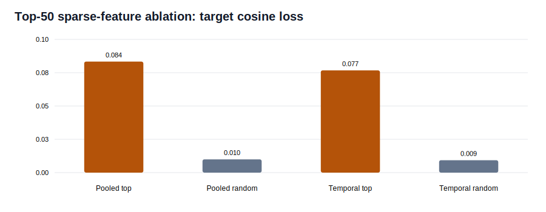

# Temporal HuBERT Bottleneck Interpretability

The temporal HuBERT student was evaluated with the same frozen probes, fold-specific
Top-K sparse autoencoders, and controlled feature ablations as the pooled-HuBERT student.

## Representation Probes

| Metric | Pooled HuBERT | Temporal HuBERT |
|---|---:|---:|
| Bottleneck class accuracy | 64.9% | 65.8% |
| Bottleneck type accuracy | 95.1% | 94.3% |
| Bottleneck speaker leakage | 11.5% | 10.4% |

The temporal bottleneck remains class- and type-informative while suppressing most
linearly decodable speaker identity.

## Sparse Reconstruction

The temporal bottleneck SAE explains **66.6%**
of held-out variance with exactly 32 of 512 features active per utterance. Reconstruction
changes class accuracy from **64.5%**
to **62.7%**;
ablations are measured relative to reconstruction.

## Top-50 Causal Ablation

| Effect | Pooled Top | Pooled Random | Temporal Top | Temporal Random |
|---|---:|---:|---:|---:|
| Target cosine change | -0.084 | -0.010 | -0.077 | -0.009 |
| Type accuracy change | -5.8 pp | -0.3 pp | -12.0 pp | -0.5 pp |
| Class accuracy change | -2.4 pp | -0.3 pp | -0.1 pp | +0.1 pp |

Temporal content-ranked features have a specific causal effect on teacher alignment and
coarse utterance type beyond random controls. Fine-grained 30-class decisions remain
distributed: the temporal top-50 intervention barely changes class accuracy.

## Boundary

This identifies causally important temporal-teacher features, not phoneme timestamps.
The silent inputs are still fixed utterance embeddings, so the next decisive experiment
must expose temporal sensor encoder activations or introduce forced-alignment labels.
