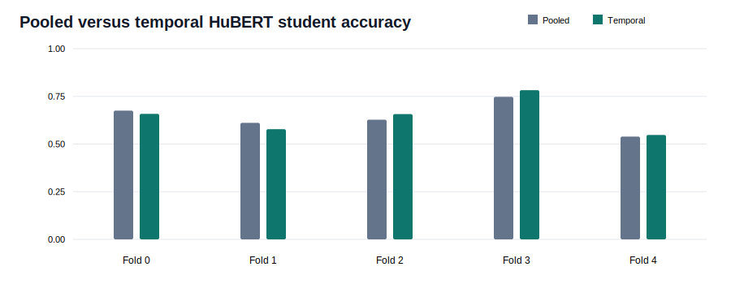

# Feature Characterization And Temporal HuBERT Batch

This batch moves the audio-teacher track from utterance-level causal evidence toward
linguistic characterization.

## Completed

1. The 15 highest-ranked fold-local sparse features were checked on held-out speakers.
   Mean held-out class eta-squared is **0.660** and
   type eta-squared is **0.206**.
2. Silence-trimmed HuBERT states were represented as four ordered relative-time segments.
3. A five-fold sensor student was trained against those temporal targets.
4. True-order alignment was compared with reversed and shifted temporal controls.
5. The temporal bottleneck was probed, sparsified, and causally ablated with random controls.

## Main Comparison

- Pooled-HuBERT student class accuracy: **64.0%**.
- Temporal-HuBERT student class accuracy: **64.5%**.
- Temporal true-order segment cosine: **0.346**.
- Temporal reversed-order cosine: **0.086**.
- True-versus-reversed margin: **+0.260**.
- Temporal top-50 feature ablation changes target cosine by
  **-0.077** versus
  **-0.009** randomly.
- Temporal top-50 feature ablation changes utterance-type accuracy by
  **-12.0 points** versus
  **-0.5 points** randomly.

Detailed evidence is in:

- `reports/hubert_sparse_feature_exemplars.md`
- `reports/hubert_temporal_teacher_student.md`
- `reports/hubert_temporal_feature_causality.md`
- `reports/hubert_bottleneck_feature_causality.md`
- `reports/temporal_sensor_interpretability.md`

## Grand-Scheme Status

The project now has a strict supervised baseline, a real pooled audio teacher, causal
sparse bottleneck features, held-out feature exemplars, and a first temporal-teacher
comparison. Temporal sensor states and measured lip-articulation probes are now complete.
The remaining interpretability gap is phoneme naming, which needs prompt text plus forced
alignment or external phonetic annotations unavailable in the local release.
