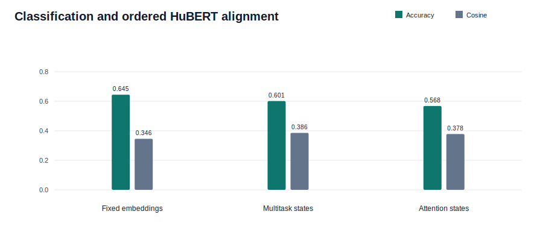

# Modality-Attention Temporal Sensor Student

This experiment evaluates an order-aware utterance classifier while retaining the
four-segment HuBERT alignment branch. Classification-loss weight is selected independently
in each fold using validation speakers only.

## Protocol

- Input: fold-specific lip, laser, mmWave, and UWB temporal encoder states.
- Teacher: four ordered, silence-trimmed HuBERT segments.
- Candidate classification weights: 0.2, 0.5, 1.0, 2.0.
- Selection score: validation accuracy plus validation true-order segment cosine.
- Test speakers remain untouched until after candidate selection.

## Test Results

| Fold | Selected CE Weight | Modality-Attention Accuracy | Previous Accuracy | Modality-Attention Cosine | Previous Cosine | Reversed Cosine | Order Margin |
|---:|---:|---:|---:|---:|---:|---:|---:|
| 0 | 0.5 | 65.0% | 67.5% | 0.401 | 0.422 | 0.070 | +0.332 |
| 1 | 0.2 | 45.6% | 46.7% | 0.337 | 0.363 | -0.027 | +0.364 |
| 2 | 0.2 | 55.9% | 56.9% | 0.424 | 0.400 | 0.077 | +0.347 |
| 3 | 1.0 | 68.7% | 74.8% | 0.353 | 0.360 | 0.011 | +0.342 |
| 4 | 0.2 | 48.7% | 54.8% | 0.374 | 0.384 | 0.038 | +0.336 |

## Aggregate

- Modality-Attention accuracy: **56.8% +/- 10.0%**.
- Previous temporal-sensor accuracy: **60.1%**.
- Fixed-embedding temporal-student accuracy: **64.5%**.
- Accuracy change: **-3.4 percentage points**.
- Modality-Attention true-order cosine: **0.378**.
- Previous temporal-sensor cosine: **0.386**.
- Alignment change: **-0.008 cosine**.
- Modality-Attention reversed-order cosine: **0.034**.
- Modality-Attention true-versus-reversed margin: **+0.344**.

## Validation Sweep

| CE Weight | Mean Validation Accuracy | Mean Validation Cosine | Selected Folds |
|---:|---:|---:|---:|
| 0.2 | 78.3% | 0.416 | 3/5 |
| 0.5 | 78.0% | 0.405 | 1/5 |
| 1.0 | 78.3% | 0.408 | 1/5 |
| 2.0 | 78.3% | 0.405 | 0/5 |

The loss-weight sweep and early stopping use validation speakers, not test results. As
before, four relative-time regions show ordered evidence but do not establish frame-exact
or phoneme-level synchronization.
