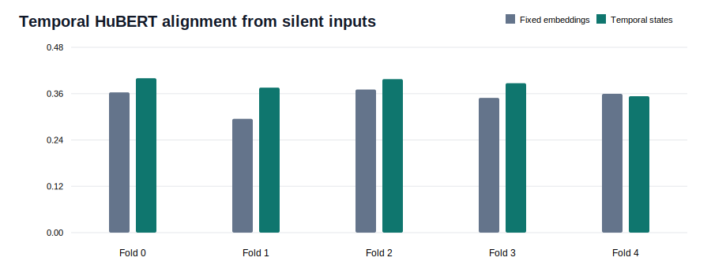
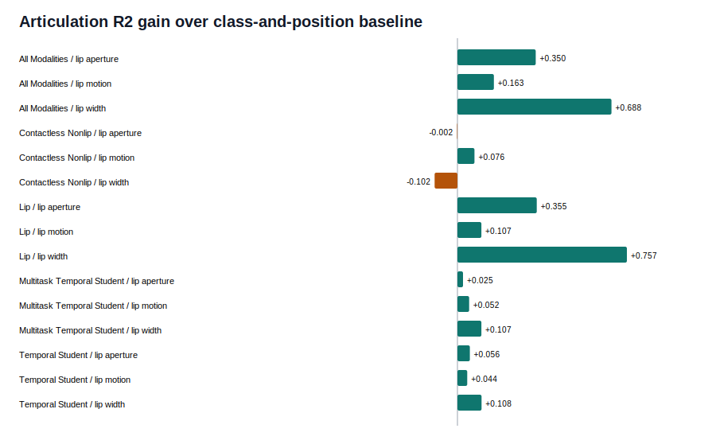

# Temporal Silent-Sensor Interpretability

This batch exposes sequence activations from the trained lip, laser, mmWave, and UWB
encoders and tests them against both temporal HuBERT and measured lip articulation.

## Data Boundary

The local RVTALL release contains anonymous corpus identifiers (`word1`, `sentences3`,
and similar) but no transcripts, TextGrids, or phoneme timestamps. Therefore this report
does **not** claim forced phoneme alignment. Its articulatory targets are directly measured
from normalized lip landmarks: inner-lip aperture, mouth width, and lip motion.

## Temporal Activation Audit

| Modality | Pairs Per Fold | Mean Raw Repetitions | Mean Encoder Steps |
|---|---:|---:|---:|
| Laser | 590-590 | 5091.0 | 141.0 |
| Lip | 596-596 | 5300.0 | 88.4 |
| Mmwave | 553-553 | 4956.0 | 36.3 |
| Uwb | 596-596 | 5255.0 | 11.2 |

Each repetition is encoded by the fold-specific model, pooled into four relative-time
regions, then averaged within each speaker/utterance pair.

## Temporal HuBERT Alignment

- Temporal-sensor class accuracy: **49.9% +/- 8.9%**.
- Temporal-sensor true-order cosine: **0.381**.
- Fixed-embedding temporal-student cosine: **0.346**.
- Reversed-order temporal-sensor cosine: **0.047**.
- True-versus-reversed margin: **+0.333**.

- Multitask temporal-sensor class accuracy: **60.1% +/- 11.1%**.
- Multitask temporal-sensor true-order cosine: **0.386**.
- Multitask true-versus-reversed margin: **+0.352**.
- Detailed multitask comparison: [multitask report](temporal_sensor_multitask.md).

- Modality-attention class accuracy: **56.8%**.
- Modality-attention true-order cosine: **0.378**.
- This branch underperforms the multitask student and remains diagnostic; see
  [attention results](temporal_sensor_attention.md) and
  [held-out weight audit](temporal_sensor_attention_audit.md).

## Articulation Probes

All probes are speaker-disjoint. They predict residual articulation beyond a training-fold
class-and-segment-position template; `Delta R2` is the gain over that stronger baseline.

| Representation | Target | R2 | Class+Position Baseline R2 | Delta R2 | Correlation | Order Margin |
|---|---|---:|---:|---:|---:|---:|
| All Modalities | Lip Aperture | 0.753 | 0.403 | +0.350 | 0.879 | +0.328 |
| All Modalities | Lip Motion | 0.596 | 0.433 | +0.163 | 0.812 | +0.432 |
| All Modalities | Lip Width | 0.110 | -0.578 | +0.688 | 0.583 | +0.014 |
| Attention Temporal Student | Lip Aperture | 0.454 | 0.403 | +0.051 | 0.697 | +0.227 |
| Attention Temporal Student | Lip Motion | 0.471 | 0.433 | +0.038 | 0.732 | +0.349 |
| Attention Temporal Student | Lip Width | -0.501 | -0.578 | +0.077 | 0.229 | -0.001 |
| Contactless Nonlip | Lip Aperture | 0.402 | 0.403 | -0.002 | 0.665 | +0.211 |
| Contactless Nonlip | Lip Motion | 0.509 | 0.433 | +0.076 | 0.750 | +0.332 |
| Contactless Nonlip | Lip Width | -0.680 | -0.578 | -0.102 | 0.105 | +0.001 |
| Laser | Lip Aperture | 0.388 | 0.401 | -0.013 | 0.654 | +0.162 |
| Laser | Lip Motion | 0.467 | 0.431 | +0.036 | 0.732 | +0.282 |
| Laser | Lip Width | -0.651 | -0.556 | -0.095 | 0.133 | -0.001 |
| Lip | Lip Aperture | 0.755 | 0.400 | +0.355 | 0.879 | +0.285 |
| Lip | Lip Motion | 0.532 | 0.425 | +0.107 | 0.784 | +0.360 |
| Lip | Lip Width | 0.178 | -0.580 | +0.757 | 0.646 | +0.019 |
| Mmwave | Lip Aperture | 0.408 | 0.405 | +0.003 | 0.670 | +0.184 |
| Mmwave | Lip Motion | 0.463 | 0.426 | +0.037 | 0.721 | +0.307 |
| Mmwave | Lip Width | -0.621 | -0.595 | -0.026 | 0.198 | +0.009 |
| Multitask Temporal Student | Lip Aperture | 0.428 | 0.403 | +0.025 | 0.685 | +0.231 |
| Multitask Temporal Student | Lip Motion | 0.486 | 0.433 | +0.052 | 0.745 | +0.345 |
| Multitask Temporal Student | Lip Width | -0.471 | -0.578 | +0.107 | 0.238 | -0.007 |
| Temporal Student | Lip Aperture | 0.459 | 0.403 | +0.056 | 0.700 | +0.227 |
| Temporal Student | Lip Motion | 0.477 | 0.433 | +0.044 | 0.733 | +0.337 |
| Temporal Student | Lip Width | -0.470 | -0.578 | +0.108 | 0.248 | -0.001 |
| Uwb | Lip Aperture | 0.394 | 0.398 | -0.004 | 0.666 | +0.206 |
| Uwb | Lip Motion | 0.468 | 0.427 | +0.041 | 0.718 | +0.317 |
| Uwb | Lip Width | -0.631 | -0.582 | -0.049 | 0.165 | +0.007 |

The non-lip contactless sensors do not improve average held-out articulation R2 beyond the class-and-position template in this experiment. Their mean delta across aperture, width, and motion is
**-0.009 R2**, but lip motion alone improves by
**+0.076 R2**.

## Interpretation Boundary

Relative-time pooling establishes ordered representational evidence, not frame-exact
synchronization. A true phoneme study still requires the original prompt text plus forced
alignment, or externally supplied phonetic/articulatory annotations.
