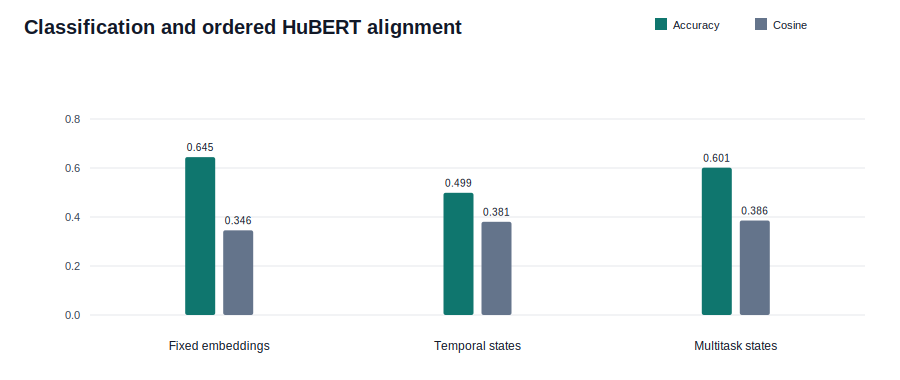

# Multitask Temporal Sensor Student

This experiment evaluates an order-aware utterance classifier while retaining the
four-segment HuBERT alignment branch. Classification-loss weight is selected independently
in each fold using validation speakers only.

## Protocol

- Input: fold-specific lip, laser, mmWave, and UWB temporal encoder states.
- Teacher: four ordered, silence-trimmed HuBERT segments.
- Candidate classification weights: 0.2, 0.5, 1.0, 2.0.
- Selection score: validation accuracy plus validation true-order segment cosine.
- Test speakers remain untouched until after candidate selection.

## Test Results

| Fold | Selected CE Weight | Multitask Accuracy | Previous Accuracy | Multitask Cosine | Previous Cosine | Reversed Cosine | Order Margin |
|---:|---:|---:|---:|---:|---:|---:|---:|
| 0 | 2.0 | 67.5% | 57.3% | 0.422 | 0.398 | 0.056 | +0.366 |
| 1 | 2.0 | 46.7% | 45.6% | 0.363 | 0.374 | -0.008 | +0.370 |
| 2 | 0.5 | 56.9% | 50.0% | 0.400 | 0.395 | 0.050 | +0.350 |
| 3 | 0.2 | 74.8% | 59.1% | 0.360 | 0.385 | -0.012 | +0.372 |
| 4 | 2.0 | 54.8% | 37.4% | 0.384 | 0.351 | 0.080 | +0.304 |

## Aggregate

- Multitask accuracy: **60.1% +/- 11.1%**.
- Previous temporal-sensor accuracy: **49.9%**.
- Fixed-embedding temporal-student accuracy: **64.5%**.
- Accuracy change: **+10.3 percentage points**.
- Multitask true-order cosine: **0.386**.
- Previous temporal-sensor cosine: **0.381**.
- Alignment change: **+0.005 cosine**.
- Multitask reversed-order cosine: **0.033**.
- Multitask true-versus-reversed margin: **+0.352**.

## Validation Sweep

| CE Weight | Mean Validation Accuracy | Mean Validation Cosine | Selected Folds |
|---:|---:|---:|---:|
| 0.2 | 76.3% | 0.421 | 1/5 |
| 0.5 | 77.7% | 0.413 | 1/5 |
| 1.0 | 77.0% | 0.433 | 0/5 |
| 2.0 | 76.6% | 0.432 | 3/5 |

The loss-weight sweep and early stopping use validation speakers, not test results. As
before, four relative-time regions show ordered evidence but do not establish frame-exact
or phoneme-level synchronization.
