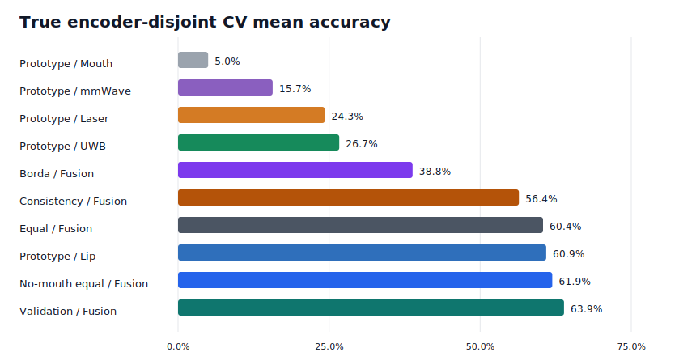
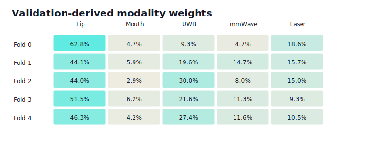
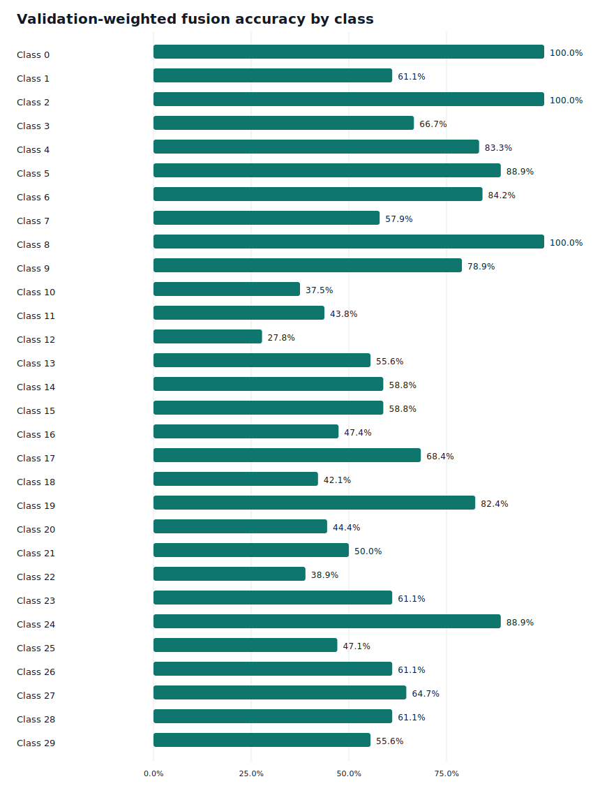

# True Encoder-Disjoint CV Results

This report is generated from the completed real-encoder, speaker/encoder-disjoint
cross-validation outputs in `reports/results/`.

## Evaluation Setup

- Dataset: RVTALL silent speech subset, 30 classes.
- Modalities: lip landmarks, mouth video, UWB radar, mmWave radar, laser speckle.
- Split: 5-fold encoder-disjoint speaker CV.
- Classifier: prototype/nearest-centroid per modality, plus late-fusion voting.
- Fusion methods: equal-weight averaging, validation-weighted averaging, Borda rank
  fusion, consistency-weighted fusion, and no-mouth equal-weight ablation.
- Chance accuracy: 3.3%.
- All reported folds have `encoder_disjoint_test=True`.

Raw outputs:

- `reports/results/true_encoder_cv_results.csv`
- `reports/results/true_encoder_cv_summary.csv`
- `reports/results/true_encoder_cv_predictions.csv`
- `reports/results/true_encoder_cv_per_class.csv`
- `reports/results/true_encoder_cv_fusion_weights.csv`
- `reports/results/true_encoder_cv_missing_artifacts.csv`

`true_encoder_cv_missing_artifacts.csv` is intentionally empty except for the header,
meaning all required fold/modality artifacts are present.

## Aggregate Accuracy



| Method | Modality | Mean Accuracy | Std. Dev. | Folds |
| --- | --- | --- | --- | --- |
| Validation-weighted fusion | Fusion | 63.9% | 6.8% | 5 |
| Equal-weight no-mouth fusion | Fusion | 61.9% | 8.9% | 5 |
| Prototype | Lip | 60.9% | 6.6% | 5 |
| Equal-weight fusion | Fusion | 60.4% | 8.4% | 5 |
| Consistency-weighted fusion | Fusion | 56.4% | 9.7% | 5 |
| Borda fusion | Fusion | 38.8% | 8.1% | 5 |
| Prototype | UWB | 26.7% | 9.3% | 5 |
| Prototype | Laser | 24.3% | 5.5% | 5 |
| Prototype | mmWave | 15.7% | 1.2% | 5 |
| Prototype | Mouth | 5.0% | 1.3% | 5 |

## Per-Fold Accuracy

| Fold | Lip | Mouth | UWB | mmWave | Laser | Equal Fusion | No-Mouth Equal | Validation Fusion | Borda | Consistency Fusion |
| --- | --- | --- | --- | --- | --- | --- | --- | --- | --- | --- |
| 0 | 61.5% | 5.1% | 27.4% | 13.7% | 16.2% | 60.7% | 64.1% | 62.4% | 37.6% | 56.4% |
| 1 | 56.7% | 4.4% | 14.4% | 16.7% | 28.9% | 50.0% | 52.2% | 57.8% | 30.0% | 44.4% |
| 2 | 56.9% | 4.9% | 33.3% | 16.7% | 21.6% | 61.8% | 63.7% | 61.8% | 34.3% | 56.9% |
| 3 | 72.2% | 3.5% | 37.4% | 15.7% | 29.6% | 73.0% | 74.8% | 75.7% | 51.3% | 71.3% |
| 4 | 57.4% | 7.0% | 20.9% | 15.7% | 25.2% | 56.5% | 54.8% | 61.7% | 40.9% | 53.0% |

## Validation-Derived Fusion Weights

These weights are estimated from each fold's validation speakers only, then applied
to the held-out test speakers.



| Fold | Lip | Mouth | UWB | mmWave | Laser |
| --- | --- | --- | --- | --- | --- |
| 0 | 63.5% | 3.5% | 9.4% | 4.7% | 18.8% |
| 1 | 44.1% | 5.9% | 19.6% | 14.7% | 15.7% |
| 2 | 44.0% | 3.0% | 30.0% | 8.0% | 15.0% |
| 3 | 52.1% | 5.2% | 21.9% | 11.5% | 9.4% |
| 4 | 46.3% | 4.2% | 27.4% | 11.6% | 10.5% |

## Per-Class Error Snapshot



Hardest classes for the best fusion method (`validation_weighted` / `fusion`):

| Class ID | Accuracy | Correct | Samples |
| --- | --- | --- | --- |
| 12 | 27.8% | 5 | 18 |
| 10 | 37.5% | 6 | 16 |
| 22 | 38.9% | 7 | 18 |
| 18 | 42.1% | 8 | 19 |
| 11 | 43.8% | 7 | 16 |
| 20 | 44.4% | 8 | 18 |
| 25 | 47.1% | 8 | 17 |
| 16 | 47.4% | 9 | 19 |
| 21 | 50.0% | 9 | 18 |
| 13 | 55.6% | 10 | 18 |

Strongest classes for the best fusion method (`validation_weighted` / `fusion`):

| Class ID | Accuracy | Correct | Samples |
| --- | --- | --- | --- |
| 0 | 100.0% | 19 | 19 |
| 2 | 100.0% | 19 | 19 |
| 8 | 100.0% | 18 | 18 |
| 5 | 88.9% | 16 | 18 |
| 24 | 88.9% | 16 | 18 |
| 6 | 84.2% | 16 | 19 |
| 4 | 83.3% | 15 | 18 |
| 19 | 82.4% | 14 | 17 |
| 9 | 78.9% | 15 | 19 |
| 17 | 68.4% | 13 | 19 |

## Main Takeaways

1. The best overall method is Validation-weighted fusion, averaging
   63.9% accuracy across five folds.
2. Validation-weighted fusion averages 63.9%, compared with
   60.4% for equal-weight fusion and 60.9% for lip alone.
3. Lip remains the dominant single modality, but validation-derived weighting recovers
   useful auxiliary signal on several folds.
4. UWB and laser carry useful but variable auxiliary signal.
5. mmWave is consistently above chance but weaker than earlier fixed-split baselines.
6. Mouth embeddings remain near chance in this CV setting and should be treated as
   provisional until the mouth encoder is retrained/audited.

## Verification

The final verification run completed with:

```text
pytest -q
20 passed
```

Strict true encoder CV completed without `--allow-missing`, confirming that the full
artifact contract is satisfied.

## Recommended Next Steps

1. Use `validation_weighted` as the current fusion baseline to beat.
2. Inspect `true_encoder_cv_per_class.csv` to target classes where auxiliary sensors help.
3. Retrain or replace the mouth encoder artifacts with full scientific fold embeddings.
4. Add plots for per-fold modality weights and per-class confusion.
5. Update manuscript/README language to treat older fixed-split numbers as legacy.
